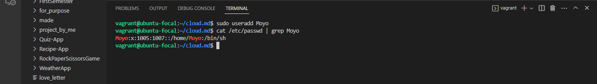
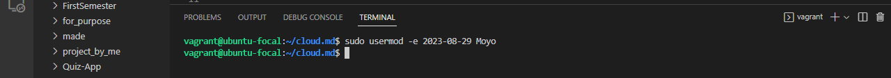
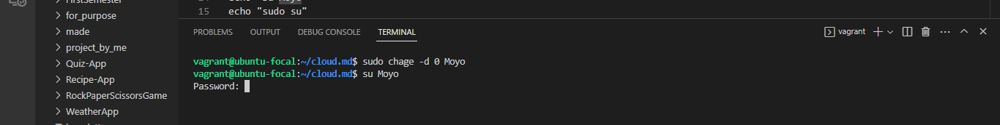
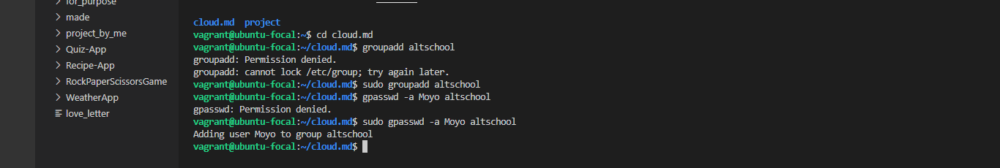

#This is a script to execute assignment given in class

#cmd to create new user
echo "sudo useradd Moyo"

#Set expiry date of 2weeks for Moyo
echo "sudo usermod -e 2023-08-29 Moyo"

#Prompt User to change password on login and return back as root user after changing password
echo "sudo chage -d 0 Moyo"
echo "su Moyo"
echo "sudo su"

#Create a group called altschool and add the user
echo "groupadd altschool"
echo "gpasswd -a Moyo altschool"

#Give read only access to altschool on /etc
#echo "sudo chmod -R g+rX /etc"
.png)

#New user without home directory
echo " useradd -M comfort
.png)

#Thank you